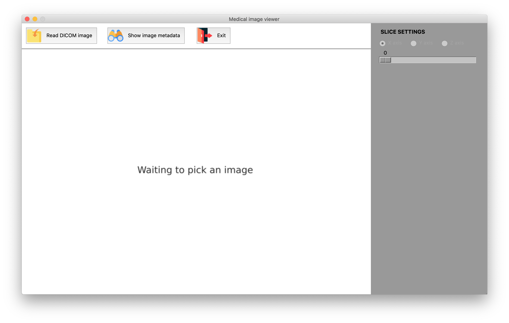
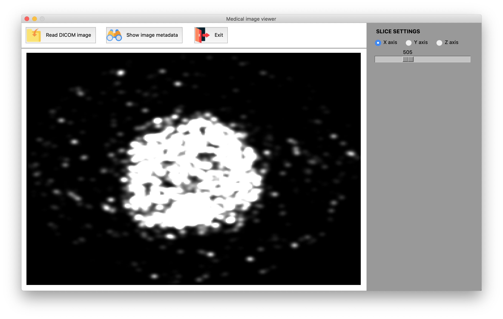

# Medical Image Viewer

In this repository, you can find an implemented system for displaying medical images in DICOM format.

This system is programmed in Python under the Model-View-Controller architecture. Below, you can see a preview of the operation of the graphical interface, which allows:

- Upload a DICOM image using the system file explorer.
- Visualize 2D slices from the three-dimensional image.
- Explore the DICOM headers of the image.

